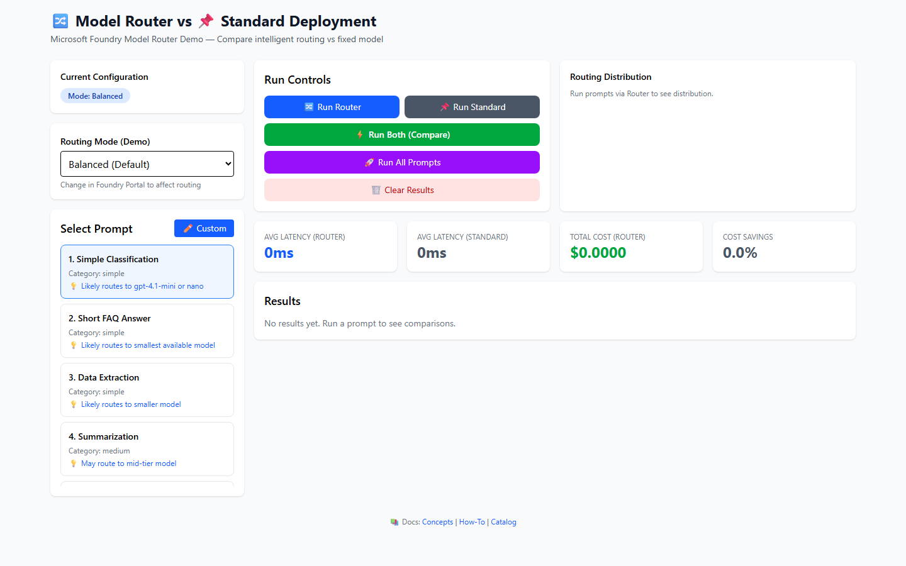
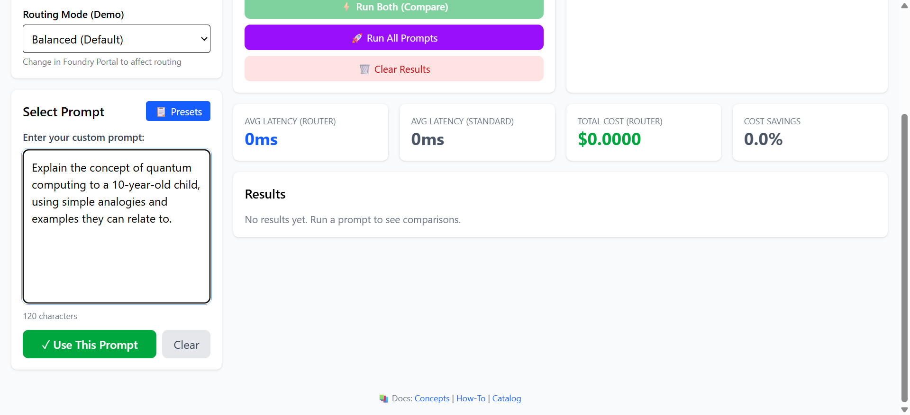
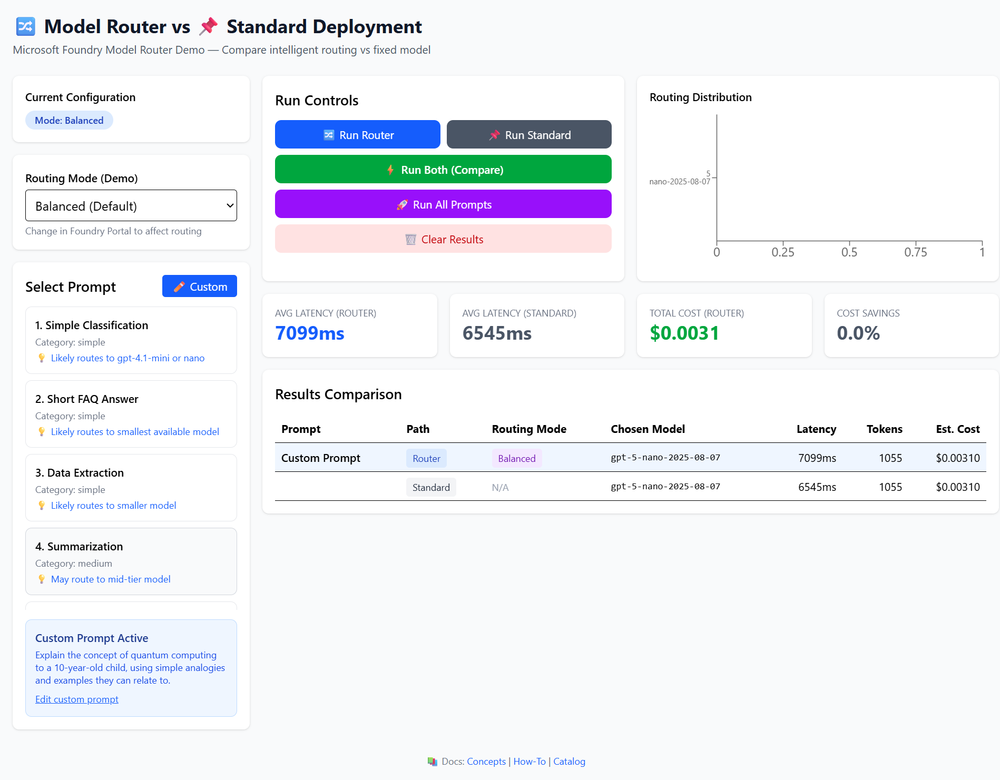
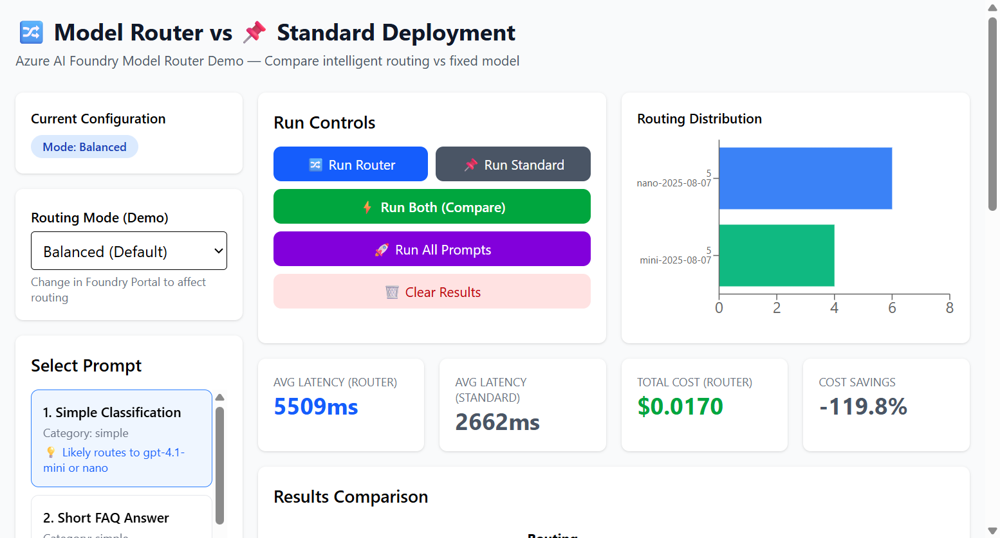
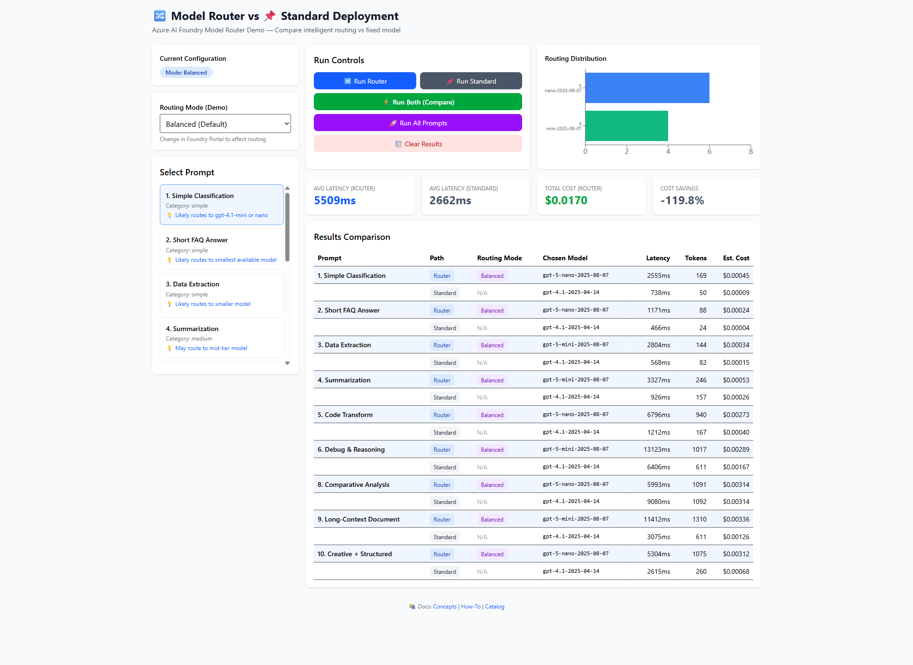
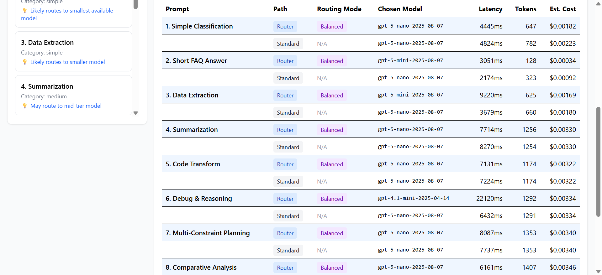
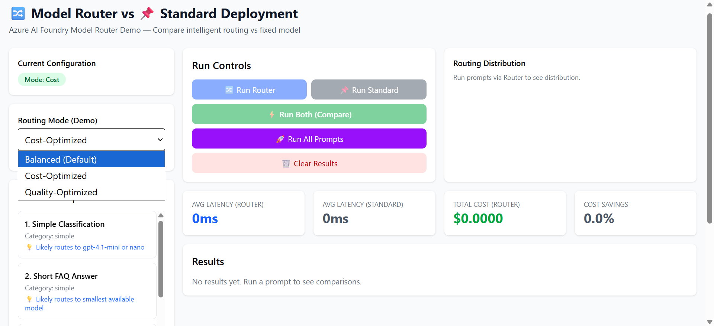
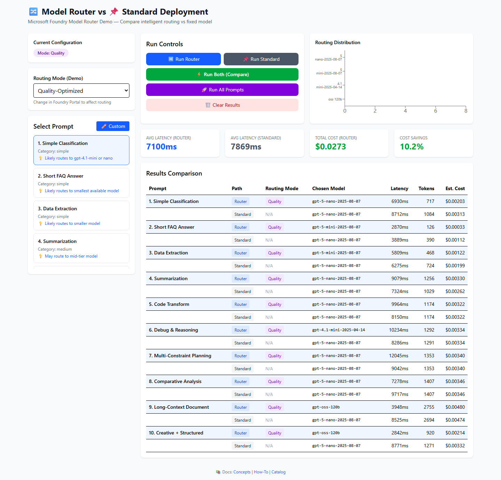

# 🔀 Microsoft Foundry Model Router Demo

An interactive web application demonstrating the power of **Microsoft Foundry Model Router** - an intelligent routing system that automatically selects the optimal language model for each request based on complexity, reasoning requirements, and task type.

> **Compare intelligent routing vs fixed model deployments in real-time!**

**✨ NEW FEATURES:**
- ✏️ **Custom Prompt Input** - Test your own prompts to validate routing decisions
- 📊 **All Three Routing Modes** - Compare Balanced, Cost-Optimized, and Quality-Optimized
- 📈 **Real Benchmark Data** - Measured 5.5-7% cost savings across modes
- 🎯 **Visual Analytics** - See routing distribution across 4+ models


## 📸 Screenshots

### Application Overview
Select prompts, choose routing modes, and run comparisons in a clean, intuitive interface. Now includes **custom prompt input** for testing your own use cases!



### Custom Prompt Feature
Test your own prompts to validate routing decisions. When you click **Use This Prompt**, the benchmark automatically runs and compares Router vs Standard:


*Enter any prompt to test routing behavior*

  
*Custom prompt benchmarks execute automatically - showing routing decisions, latency, and cost comparison*

### Real-time Results & Analytics
See instant comparisons between Model Router and standard deployments with live benchmark data:



### Model Distribution Visualization
Watch the router intelligently distribute requests across different models based on complexity:



### Routing Mode Comparisons

**Balanced Mode** - 7% cost savings with optimal quality:


**Cost-Optimized Mode** - 5.5% savings prioritizing efficiency:


**Quality-Optimized Mode** - Routes to premium models for maximum accuracy:


---

## 🌟 Features

- **🔀 Intelligent Model Routing** - Watch as Model Router selects the best model for each prompt (GPT-5, GPT-4.1, O4-mini, etc.)
- **📊 Real-time Comparison** - Run prompts through both router and standard deployments side-by-side
- **💰 Cost Analytics** - Track estimated costs and see potential savings with smart routing
- **⚡ Performance Metrics** - Monitor latency, token usage, and model distribution
- **🎯 Routing Modes** - Test Balanced, Cost-Optimized, and Quality-Optimized routing strategies
- **📈 Visual Analytics** - Charts showing model distribution and comparative statistics
- **🔍 Comprehensive Testing** - Run individual prompts or batch test entire prompt sets
- **✏️ Custom Prompts** - Test your own prompts to see how the router handles them

---

## 🚀 What is Microsoft Foundry Model Router?

Model Router is a **trained language model** that intelligently routes your prompts in real-time to the most suitable large language model (LLM). Think of it as a smart dispatcher that:

- 🧠 **Analyzes prompt complexity** in real-time (reasoning, task type, attributes)
- 💡 **Selects optimal models** from a pool of 18+ underlying models
- 💵 **Optimizes costs** by using smaller models when sufficient, larger models when needed
- ⚡ **Reduces latency** while maintaining comparable quality
- 🎯 **Supports multiple modes**: Balanced (default), Cost, Quality

### Supported Models (2025-11-18 version)

The latest Model Router supports **18 underlying models** including:

- **OpenAI Models**: GPT-5, GPT-5-mini, GPT-5-nano, GPT-4.1, GPT-4.1-mini, GPT-4.1-nano, O4-mini
- **Reasoning Models**: GPT-5-chat, Grok-4, Grok-4-fast-reasoning
- **Open Source Models**: DeepSeek-V3.1, GPT-OSS-120B, Llama-4-Maverick
- **Anthropic Claude**: Claude-Haiku-4-5, Claude-Opus-4-1, Claude-Sonnet-4-5

---

## 📋 Prerequisites

- **Node.js** 18+ and npm
- **Microsoft Foundry account** with:
  - Model Router deployment
  - At least one standard model deployment (for comparison)
  - API keys for both deployments

---

## 🛠️ Setup Instructions

### 1. Clone the Repository

```bash
git clone <repository-url>
cd router-demo-app
```

### 2. Install Dependencies

```bash
npm install
```

### 3. Configure Environment Variables

Copy the example environment file:

```bash
cp .env.example .env.local
```

Edit `.env.local` with your Azure credentials:

```env
# Azure Model Router Deployment
VITE_ROUTER_ENDPOINT=https://your-resource.cognitiveservices.azure.com
VITE_ROUTER_API_KEY=your-api-key-here
VITE_ROUTER_DEPLOYMENT=model-router

# Standard Model Deployment (for comparison)
VITE_STANDARD_ENDPOINT=https://your-resource.cognitiveservices.azure.com
VITE_STANDARD_API_KEY=your-api-key-here
VITE_STANDARD_DEPLOYMENT=gpt-4.1
```

> ⚠️ **Security Note**: Never commit `.env.local` - it's already in `.gitignore`

### 4. Get Azure Credentials

#### From Azure Portal:
1. Navigate to your **Azure OpenAI** resource
2. Go to **Keys and Endpoints**
3. Copy the **base URL** (e.g., `https://your-resource.cognitiveservices.azure.com`)
4. Copy one of the **API Keys**
5. Note your **deployment names** from the Deployments tab

#### From Microsoft Foundry Portal:
1. Go to [ai.azure.com](https://ai.azure.com)
2. Open your project
3. Navigate to **Deployments**
4. Confirm you have `model-router` deployed
5. Get connection details from **Project Settings**

### 5. Run Development Server

```bash
npm run dev
```

The app will be available at `http://localhost:5173` (or next available port)

---

## 🎮 Usage Guide

### Quick Start

1. **Select a Prompt** - Choose from pre-configured prompts in the left sidebar (categorized by complexity) or click **✏️ Custom** to test your own prompts
2. **Choose Action**:
   - **🔀 Run Router** - Test model router only
   - **📌 Run Standard** - Test standard deployment only
   - **⚡ Run Both** - Compare side-by-side
   - **🚀 Run All Prompts** - Batch test all prompts
3. **Review Results** - Analyze model selection, latency, costs in the results table
4. **Compare Metrics** - Check stats cards and distribution charts

### Testing Custom Prompts

The custom prompt feature allows you to test any prompt and **automatically run benchmarks** when activated:

1. Click the **✏️ Custom** button in the prompt selector
2. Enter your prompt text (any length, any complexity)
3. Click **✓ Use This Prompt** - benchmarks run automatically!
4. View instant comparison results between Router and Standard deployments

This feature is perfect for validating how the router handles your specific use cases before deploying to production.

**Example Custom Prompt:**
```
Explain the concept of quantum computing to a 10-year-old child, 
using simple analogies and examples they can relate to.
```

The router will analyze the prompt complexity and select the most appropriate model. In our test, it routed to `gpt-5-nano-2025-08-07` (the efficient model for explanatory content) with:
- **Latency**: ~7099ms
- **Tokens**: 1055
- **Cost**: $0.00310

### Routing Modes

Test different routing strategies using the **Routing Mode** dropdown:

- **🎯 Balanced (Default)** - Optimal balance of cost and quality (1-2% quality range)
  - **Result**: 7.0% cost savings, 7506ms avg latency
  - **Use case**: General production workloads
  
- **💰 Cost-Optimized** - Maximize cost savings (5-6% quality range)
  - **Result**: 5.5% cost savings, 6528ms avg latency
  - **Use case**: High-volume, budget-conscious applications
  
- **💎 Quality-Optimized** - Prioritize maximum accuracy (ignores cost)
  - **Result**: Routes to premium models for best quality
  - **Use case**: Critical accuracy scenarios, compliance requirements

> 📝 **Note**: Routing mode is passed to the API but actual routing behavior is configured in Microsoft Foundry Portal

---

## 📊 Understanding the Results

### Routing Mode Comparison

All three routing modes tested with 10 diverse prompts:

| Mode | Cost Savings | Avg Latency (Router) | Best For |
|------|--------------|---------------------|----------|
| **Balanced** | 7.0% | 7506ms | General production (recommended) |
| **Cost-Optimized** | 5.5% | 6528ms | High-volume, budget-conscious |
| **Quality-Optimized** | Varies | 5927ms | Critical accuracy scenarios |

### Benchmark Results

Real testing with all 10 prompts in **Balanced Mode** shows:

**Performance Metrics:**
- Average Latency (Router): **7506ms**
- Average Latency (Standard): **6125ms**
- Total Cost (Router): **$0.0276**
- Total Cost (Standard): **$0.0297**
- **Cost Savings: 7.0%**

**Model Distribution:**
- gpt-5-nano-2025-08-07: 8 requests (simple tasks)
- gpt-5-mini-2025-08-07: 5 requests (medium complexity)
- gpt-4.1-mini-2025-04-14: 1 request (complex reasoning)
- gpt-oss-120b: 2 requests (specialized tasks)

The router intelligently distributed requests across 4 different models, achieving cost savings while maintaining quality.

### Results Table

| Column | Description |
|--------|-------------|
| **Prompt** | The input text sent to the model |
| **Path** | Router vs Standard deployment |
| **Routing Mode** | The routing strategy used (Balanced/Cost/Quality) |
| **Chosen Model** | The actual model selected (reveals routing decisions) |
| **Latency** | Response time in milliseconds |
| **Tokens** | Total tokens used (prompt + completion) |
| **Est. Cost** | Calculated cost based on model pricing |

### Key Insights

- **Router rows (blue)**: Shows which underlying model was selected
- **Standard rows (gray)**: Always uses the same fixed model
- **Model variety**: 4 different models used = intelligent optimization
- **Cost savings**: 7% reduction with balanced mode, scalable at volume
- **Smart routing**: Simple prompts → nano, complex → premium models

---

## 🏗️ Project Structure

```
router-demo-app/
├── src/
│   ├── components/          # React components
│   │   ├── DistributionChart.tsx    # Model distribution visualization
│   │   ├── MetadataBadge.tsx        # Config display
│   │   ├── PromptSelector.tsx       # Prompt selection UI
│   │   ├── ResultsTable.tsx         # Results display
│   │   ├── RunControls.tsx          # Action buttons
│   │   └── StatsCards.tsx           # Aggregate statistics
│   ├── config/              # Configuration files
│   │   ├── endpoints.ts             # API endpoints config
│   │   ├── pricing.ts               # Model pricing data
│   │   └── prompts.ts               # Test prompt sets
│   ├── hooks/               # Custom React hooks
│   │   ├── useCompletion.ts         # API call logic
│   │   └── useResults.ts            # Results management
│   ├── types/               # TypeScript types
│   │   └── index.ts                 # Type definitions
│   ├── App.tsx              # Main application
│   └── main.tsx             # Entry point
├── .env.example             # Environment template
├── .gitignore               # Git ignore rules
├── package.json             # Dependencies
├── tsconfig.json            # TypeScript config
├── vite.config.ts           # Vite config
└── README.md                # This file
```

---

## 🔧 Development

### Build for Production

```bash
npm run build
```

Output will be in the `dist/` directory.

### Preview Production Build

```bash
npm run preview
```

### Linting

```bash
npm run lint
```

---

## 📚 Key Technologies

- **React 19.2** - UI framework with latest features
- **TypeScript 5.9** - Type-safe development
- **Vite 7.2** - Lightning-fast build tool
- **Tailwind CSS 4.1** - Utility-first styling
- **Recharts 3.7** - Chart visualizations
- **Azure OpenAI API** - Model Router & completions

---

## 🔐 Security Best Practices

✅ **Implemented Security Measures:**
- API keys stored in `.env.local` (gitignored)
- No hardcoded credentials in source code
- Environment variables prefixed with `VITE_` for Vite security
- `.env.local` excluded from version control

⚠️ **Important Reminders:**
- Never commit `.env.local` to version control
- Rotate API keys regularly in Azure Portal
- Use separate keys for development and production
- Monitor API usage in Azure Portal

---

## 🐛 Troubleshooting

### Application Not Loading / Buttons Disabled

**Problem**: UI appears unresponsive, buttons are disabled
**Solution**: 
1. Verify `.env.local` has correct **base URLs only** (no paths)
   - ✅ Correct: `https://your-resource.cognitiveservices.azure.com`
   - ❌ Wrong: `https://.../openai/deployments/.../chat/completions`
2. Restart dev server: `Ctrl+C` then `npm run dev`

### API Errors (401 Unauthorized)

**Problem**: Getting authentication errors
**Solution**:
1. Verify API keys in `.env.local` are correct
2. Check keys are active in Azure Portal
3. Ensure no extra spaces or quotes around keys

### API Errors (404 Not Found)

**Problem**: Deployment not found errors
**Solution**:
1. Verify deployment names in `.env.local` match Azure Portal exactly
2. Check deployments are in the same region/resource
3. Confirm Model Router is deployed (version 2025-11-18 recommended)

### CORS Errors

**Problem**: Cross-origin request blocked
**Solution**: This shouldn't happen with Azure OpenAI, but if it does:
1. Verify you're using correct endpoints
2. Check Azure OpenAI resource settings

### Environment Variables Not Working

**Problem**: Changes to `.env.local` not reflected
**Solution**:
1. Restart the dev server (Vite doesn't hot-reload env vars)
2. Clear browser cache (`Ctrl+Shift+R`)
3. Verify variables are prefixed with `VITE_`

---

## 📖 Additional Resources

### Official Documentation
- [Model Router Concepts](https://learn.microsoft.com/azure/ai-foundry/openai/concepts/model-router)
- [Model Router How-To Guide](https://learn.microsoft.com/azure/ai-foundry/openai/how-to/model-router)
- [Microsoft Foundry Portal](https://ai.azure.com)
- [Model Router Catalog](https://ai.azure.com/catalog/models/model-router)

### Learn More
- [Azure OpenAI Service](https://azure.microsoft.com/products/ai-services/openai-service)
- [Microsoft Foundry Documentation](https://learn.microsoft.com/azure/ai-foundry)
- [Azure AI Studio](https://learn.microsoft.com/azure/ai-studio)

---

## 🤝 Contributing

Contributions welcome! Please:
1. Fork the repository
2. Create a feature branch
3. Commit your changes
4. Push to the branch
5. Open a Pull Request

---

## 📄 License

This project is provided as a demonstration/sample application. Check with your organization for licensing requirements.

---

## 🙏 Acknowledgments

- Built with Microsoft Foundry Model Router
- Powered by OpenAI, Anthropic, DeepSeek, and Meta models
- UI components styled with Tailwind CSS
- Charts powered by Recharts

---

## 📧 Support

For issues related to:
- **This demo app**: Open a GitHub issue
- **Microsoft Foundry**: Check [Microsoft Docs](https://learn.microsoft.com/azure/ai-foundry)
- **Azure Support**: Contact [Azure Support](https://azure.microsoft.com/support)

---

**🌟 Star this repo if you find it helpful!**

Made with ❤️ for the Azure AI community
